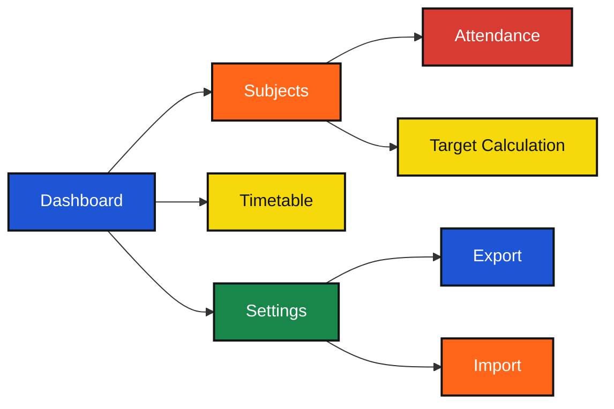

<div align="center">

# Attendance Manager

### A simple browser based attendance tracker

[]()
[]()
[]()
[]()

</div>

## Why I built this

Attendance usually gets tracked in different places, but the useful part is knowing what your current percentage actually means.

This project keeps the important parts together: subject wise attendance, the target percentage, how many classes you need to attend, and how many you can safely miss.

It also includes a timetable and data backup so the tracker can stay useful beyond a single page.

## What it does

Attendance Manager lets you:

- Add and edit subjects
- Record present and absent classes
- Set a target attendance percentage
- View subject wise attendance
- Calculate classes needed to reach the target
- Calculate how many classes can be missed while staying above the target
- View overall attendance
- Manage a weekly timetable
- Export attendance data as JSON
- Import saved attendance data
- Reset stored data
- Keep data in the browser with `localStorage`

## Features

<div align="center">

<table>
<tr>

<td width="300" align="center">


### Attendance Tracking

Subject wise percentages, attended classes, total classes, and overall attendance.

</td>

<td width="300" align="center">


### Target Calculator

Shows how many classes are needed to reach the target and how many can be missed.

</td>

<td width="300" align="center">


### Timetable

Add class slots by day and time and connect them with subjects.

</td>

</tr>
</table>

</div>

## Tech stack

| Technology | Used for |
|---|---|
| HTML5 | Page structure and application screens |
| CSS3 | Layout, responsive design, cards, modals, and UI styling |
| JavaScript | Attendance logic, navigation, timetable, settings, and interactions |
| localStorage | Saving subjects, timetable data, and attendance target |
| JSON | Exporting and importing application data |
| Web App Manifest | Browser install and standalone app support |

## How the calculations work

The app calculates each subject percentage from:

```text
Attendance % = Classes Attended / Total Classes × 100
````

When attendance is below the target, it calculates the number of future classes that need to be attended to reach that target.

When attendance is above the target, it calculates how many classes can be missed while staying at or above the target.

## App flow



## Data

The app stores its data in the browser.

```text
attendance_subjects
attendance_timetable
attendance_target
```

Attendance data can also be exported as a JSON backup and imported later.

## Maintainer

<div align="center">

<a href="https://github.com/VigneshCdx">
  
  <br>
</a>

</div>

<div align="center">

Built by [@VigneshCdx](https://github.com/VigneshCdx)

</div>
